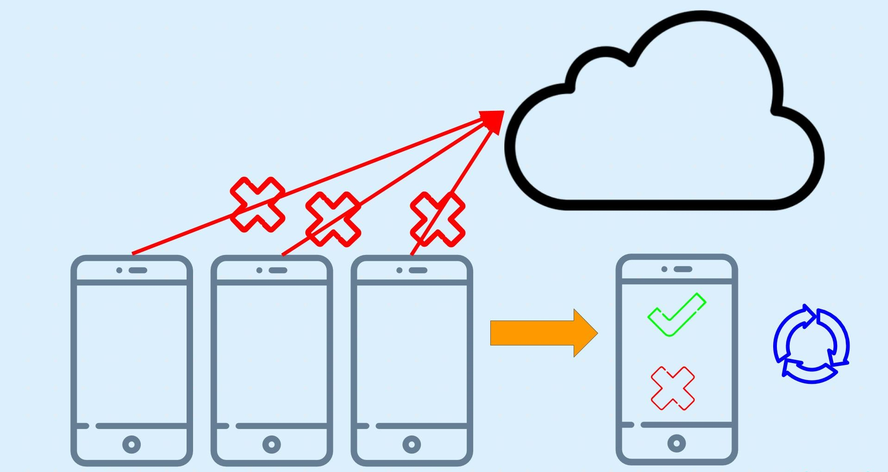
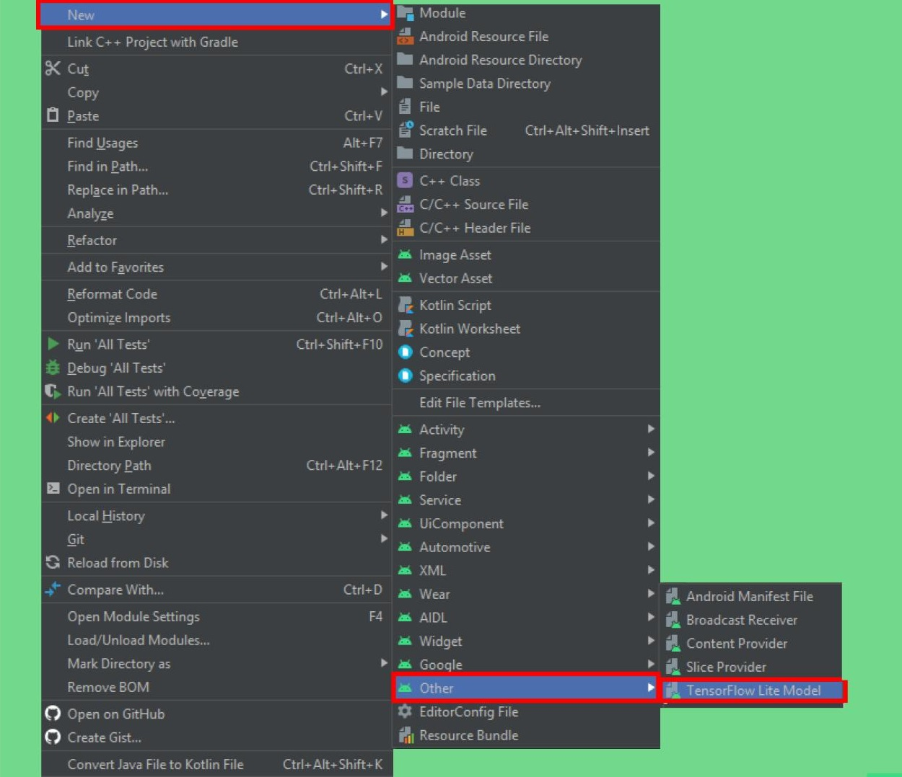
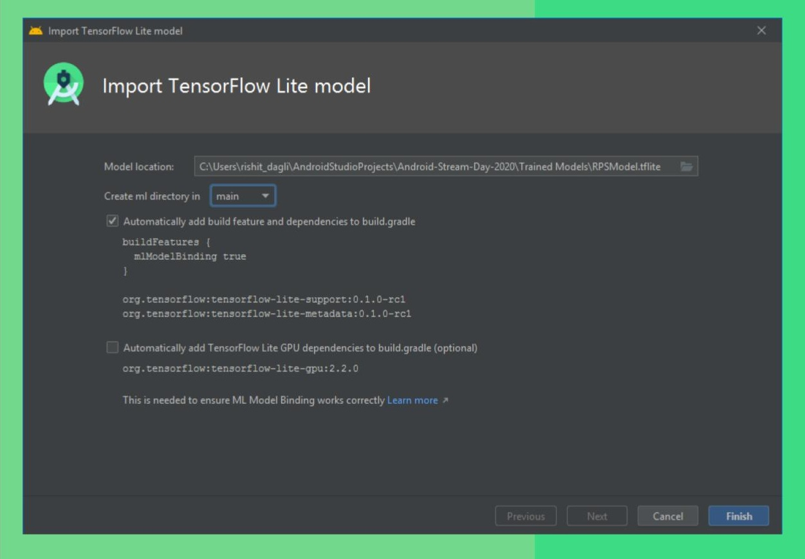
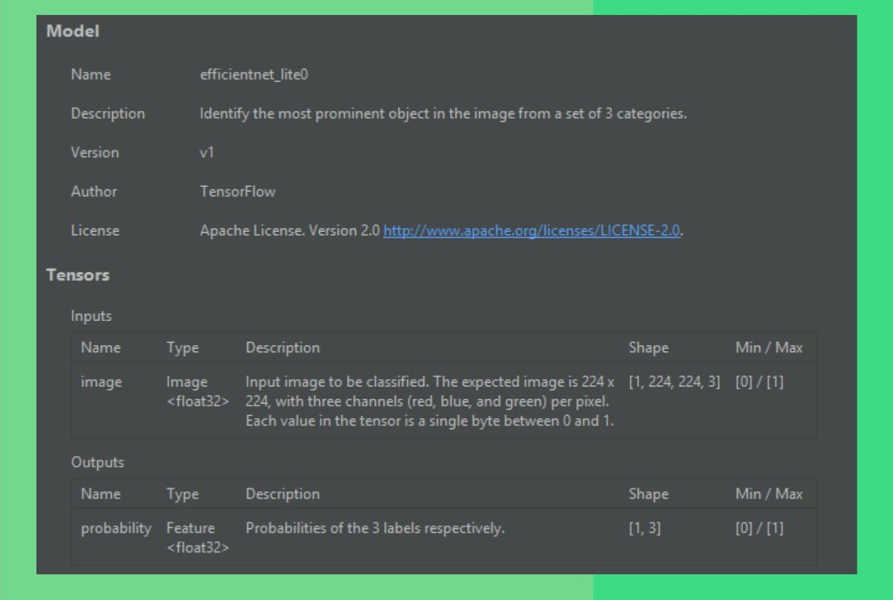
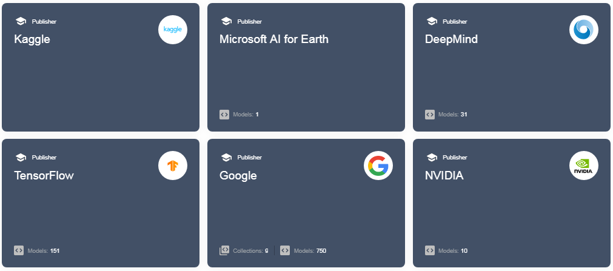

# Machine Learning in Android 11


|||
|---|---|

This repository demonstrates how you can get started with on-device ML with 
tools or plugins specifically launched with 
[Android 11](https://developer.android.com/11). If you have earlier worked with 
ML in Android, you will explore easier ways to integrate your ML applications 
with your Android apps. In this repository I majorly demonstrate the two 
biggest updates: 
[ML Model Binding Plugin](https://android-developers.googleblog.com/2020/06/tools-for-custom-ML-models.html)
and the [new ML Kit](https://android-developers.googleblog.com/2020/06/tools-for-custom-ML-models.html)
.

You can know more or watch the talks I gave on this topic - 
[talks.md](https://github.com/Rishit-dagli/ML-with-Android-11/blob/master/talks.md)

## Table of Contents

- [Why care about on-device ML in Android?](#why-care-about-on-device-ml-in-android-)
  * [The idea behind on-device ML](#the-idea-behind-on-device-ml)
  * [Advantages of on-device ML](#advantages-of-on-device-ml)
- [ML Model Binding Plugin](#ml-model-binding-plugin)
  * [What does Model Binding Plugin focus on?](#what-does-model-binding-plugin-focus-on-)
  * [Using the Model Binding Plugin](#using-the-model-binding-plugin)
    + [Import a TF Lite Model](#import-a-tf-lite-model)
    + [Using the TF Lite Model](#using-the-tf-lite-model)
  * [Leveraging GPU Acceleration](#leveraging-gpu-acceleration)
- [New ML Kit](#new-ml-kit)
  * [What does the new ML Kit focus on?](#what-does-the-new-ml-kit-focus-on-)
  * [Using the ML Kit](#using-the-ml-kit)
- [Finding Models](#finding-models)
- [Wish to contribute to this repository? :sparkles:](#wish-to-contribute-to-this-repository---sparkles-)
  * [1. Fork this repository :fork_and_knife:](#1-fork-this-repository--fork-and-knife-)
  * [2. Clone this repository :busts_in_silhouette:](#2-clone-this-repository--busts-in-silhouette-)
  * [3. Set it up :wrench:](#3-set-it-up--wrench-)
  * [4. Ready, Set, Go!!! :turtle::rabbit2:](#4-ready--set--go-----turtle--rabbit2-)
  * [5. Create a new branch :bangbang:](#5-create-a-new-branch--bangbang-)
  * [6. Push your awesome work to your remote repository :rocket:](#6-push-your-awesome-work-to-your-remote-repository--rocket-)
  * [7. Finally, make a PR! :fire:](#7-finally--make-a-pr---fire-)

## Why care about on-device ML in Android?

As you might have noticed we majorly focus on on-device ML here, Android 11 has 
a lot of cool updates for on-device ML but let's talk in brief about why you 
should care about it, you will also understand why there is such a hype about 
on-device ML or ML on edge.

### The idea behind on-device ML

While performing on-device ML opposed to the traditional approach you no longer 
send data to a server or some cloud based system which does the ML part for you 
and then returns me the outputs. So as an example if you were classifying if an 
image as an example if the image contains cat or dog, you would no longer send 
the data here the image to a server. You would instead do the inference on the 
data on the device itself, do all the computation on the device itself.



You would not directly use the model for your edge device. You would need to 
compress it or optimize the model so you can run it on the edge device as it 
has limited computation power, network availaibility and disk space. In this
document however, we will not be discussing about the optimization proccess. We 
will be deploying a `.tflite` model file. You can read more about 
[TensorFlow Lite](https://www.tensorflow.org/lite/) and the 
[Model Optimization process](https://www.tensorflow.org/lite/performance/model_optimization)
with TensorFlow Lite.

### Advantages of on-device ML

Here I have listed some advantages of using on-device ML:

- Power consumption

So the first thing that would come to your mind is power consumption, you spend 
a lot of power sending or streaming video data continuously to a server and 
sometimes it becomes infeasible to do so. However, also worth a mention 
sometimes the opposite could also be true when you employ heavy pre-processing.

- Inference time

Another important thing to consider is the time it takes me get the output or
essentially run the model. For real time applications this is a pretty important
aspect to consider. Without sending the data and the having to receive it back 
I speed up my inference time too.

- Network availability 

Using the traditional approach is also expensive in terms of network 
availability. I should have the bandwidth or network to continuously send the 
data and receive inferences from the server. 

- Security 

And finally security I no longer send data to a server or cloud based system, 
I no longer send data out of the device at all thus enforcing security.

## ML Model Binding Plugin

### What does Model Binding Plugin focus on?

> Note: You need Android Studio 4.1 or above to be able to use the Model 
> Binding Plugin

You can make a fair enough guess from the name “Model Building” so as to what 
the [ML Model Binding Plugin](https://developer.android.com/studio/preview/features#tensor-flow-lite-models)
would do allow us to use custom TF Lite Models 
very easily. This lets developers import any TFLite model, read the input / 
output signature of the model, and use it with just a few lines of code that 
calls the open source TensorFlow Lite Android Support Library.

The ML model binding plugin makes it super easy for you to use a TF model in 
your app. You essentially have a lot less code to write that calls the 
TensorFlow Lite Android Support Library. If you have worked with TensorFlow 
Lite models you maybe know that you first need to convert everything to a 
`ByteArray` you no longer have to convert everything to `ByteArray` anymore with
ML Model Binding Plugin.

What I also love about this new plugin is you can easily use make use of GPUs 
and the NN API very easily. With the model binding plugin using them has never 
been easier. Using them is now just a dependency call and a single line of code
away, isn’t that cool what you can do with Model Binding plugin. With Android 11
The Neural Network API you also have unsigned integer weight support and a new 
Quality of Service (QOS) API too supporting even more edge scenarios. And Of 
course this would make your development a lot more faster with the features we 
just talked about.

### Using the Model Binding Plugin

Let us now see how we can implement all what we talked about.

#### Import a TF Lite Model

So the first step is to import a TensorFlow Lite model with metadata. 
Android Studio now has a new option for importing TensorFlow model, 
just right click on the module you want to import it in and you will see an 
option under `others` called `TF Lite model`. 



You can now just pass in path of your `tflite` model, it will import the model 
for you in a directory in the module you selected earlier called `ml` from where
you will be able to use the model. Adding the dependencies and GPU acceleration 
too is just a click away.



So now from my model metadata I can also know the input, output shapes and a 
lot more that I would need to use it, you can see this info by opening the 
`tflite` model file in Android Studio. So in this screenshot I am using an 
open-source model made by me to classify between rock, paper and scissors. So 
you just show your hand in front of the camera and it identifies if it's a rock 
paper or scissor, and that's what I demonstrate here too.



#### Using the TF Lite Model

Let’s finally start using the model, so for a streaming inference which is most
probably what you would want to do; live image classification. The easiest way 
would be to use Camera X and pass each frame to a function which can perform the
inference. So what I’m interested as of now is the function which does the 
inference. You will see how easy it is do this, a sample code for this is also 
seem when you import a TF Lite Model which you can use.

```kotlin
private val rpsModel = RPSModel.newInstance(ctx)
```

So we’ll start by instantiating a `rps` model short for a rock papers scissors 
model and pass it the context. With the plugin, my model name was 
`RPS Model.tflite` so a class of the exact same name would be made for you so I 
have a class called `RPS Model`.

```kotlin
val tfImage = TensorImage.fromBitmap(toBitmap(imageProxy))
```

Once you do this you need to convert your data into a form which we can use so 
we’ll convert it to a `Tensor Image` from `bitmap`, if you used the TF 
Interpreter you know that you need to convert your image to a `ByteArray`, 
you dont need to do that anymore and you’ll feed in an image proxy

```kotlin
val outputs = rpsModel.process(tfImage)
    .probabilityAsCategoryList.apply {
        sortByDescending { it.score } // Sort with highest confidence first
    }.take(MAX_RESULT_DISPLAY) // take the top results
```

So now we will pass in the data to the model so first we will process the image 
from the model and get the outputs we will essentially get an array of 
probabilities and perform a descending sort on it as we want to show the label 
which has most probability and then pick first `n` results to show.

```kotlin
for (output in outputs) {
    items.add(
        Recognition(
            output.label,
            output.score
        )
    )
}
```

And finally I want to show users the labels so I will add the label 
corresponding to each entry in the outputs. And that’s all you need :rocket:.

### Leveraging GPU Acceleration

If you want to use GPU acceleration again it is made very easy for you so you 
will make an `options` object where I specify it to use GPU and build it. In 
the instantiation part, I would just pass this in as an argument and you can use
the GPU. It also makes it very easy to use the NN API for acceleration to do 
even more and with Android 11.

```kotlin
private val options = Model.Options.Builder().setDevice(Model.Device.GPU).build()
private val rpsModel = rpsModel.newInstance(ctx, options)
```

## New ML Kit

### What does the new ML Kit focus on?

The other notable update Another way to implement a TensorFlow Lite model is 
via [ML Kit](https://g.co/mlkit). And before I move on ML Kit is now available 
even without having to use a Firebase project, you can now use ML Kit even 
without a Firebase project.

As I mentioned earlier a lot of updates in Android 11 are focused on on-device 
ML due to the benefits I mentioned earlier. The new ML Kit now has better 
usability for on-device ML. The ML Kit 
[image classification](https://developers.google.com/ml-kit/vision/image-labeling/custom-models/android) 
and 
[object detection and tracking (ODT)](https://developers.google.com/ml-kit/vision/object-detection/custom-models/android) 
now also support custom models, which means now you can also have a `tflite` 
model file along with this. This also means if you are working on some generic 
use case like a specific kind of object detection ML Kit is the best thing to 
use.

### Using the ML Kit

Let's see this in code and see an example of this.
So here as an example I build a model which can classify different food items, 

```kotlin
private localModel = LocalModel.Builder()
    .setAssetFilePath("lite-model_aiy_vision_classifier_food_V1_1.tflite").
    .build()
```

So I will first start off by setting the model and specifying the `tflite`
model file path for it.

```kotlin
private val customObjectDetectorOptions = CustomObjectDetectorOptions
    .Builder(localModel)
    .setDetectorMode(CustomObjectDetectorOptions.STREAM_MODE) 
    .setClassificationConfidenceThreshold(0.8f) 
    .build()
```

This `tflite` model will then run on top of the Object detection model with ML 
Kit so you can customize these options a bit. Here I have specifically used the 
`STREAM_MODE` as I want to work with streaming input and also specify the 
confidence threshold.

```kotlin
private val objectDetector = ObjectDetection.getClient(customObjectDetectorOptions) objectDetector.process(image) 
    .addOnFailureListener(Log.d(...)) 
    .addOnSuccessListener{ 
        graphicsOverlay.clear() 
        for (detectedObject in it){ 
            graphicsOverlay.add(ObjectGraphic(graphicsOverlay, detectedObject))
        } 
        graphicsOverlay.postInvalidate()} 
    .addOnCompleteListenerl imageProxy.close() } 
```

So let us get to the part where we run the model so you might see some syntax
similar to the previous example here. I will process my image and a thing to 
note here is all of these listeners that is on failure or on success are 
essentially tasks so they need to be attached for every run. 
And that is all you need to do, we are done :rocket:

## Finding Models

We talked a lot about what after making a model let us take a look at how you 
can find models for your use-cases.

- TF Lite Model Maker

TF Lite Model Maker too was announced by The TensorFlow Team earlier in 2020. 
This makes making good models super easy to use, gives a high performance and 
also allows for a good amount of customization. You can simply pass in the data
and use little code to build a `tflite` model. You can take a look at the 
[TensorFlow Lite Model Maker Example](https://github.com/Rishit-dagli/ML-with-Android-11/blob/dev/TensorFlow_Lite_Model_Maker_example.ipynb) 
present in this repo.

- TensorFlow Hub

TensorFlow Hub is an open-source repository of state of the art and well 
docuemnted, models. The food classification app we built with ML Kit is also 
present on TF Hub. You get to use models from the community. You can find these 
at [tfhub.dev](https//tfhub.dev).



And many more! There are a lot of services like 
[Teachable Machine](https://teachablemachine.withgoogle.com/), 
[AutoML](https://cloud.google.com/automl) and many more but these are the major
ones.
## Wish to contribute to this repository? :sparkles:

Do you notice a bug or want to add a feature, you can very easily contribute to 
this repo. I also advise you to take a look at 
[CODE OF CONDUCT](https://github.com/Rishit-dagli/ML-with-Android-11/blob/master/CODE_OF_CONDUCT.md) 
. Here are the steps to help you along :scroll:

### 1. Fork this repository :fork_and_knife:

You can get your own fork/copy of 
[ML with Android 11](https://github.com/Rishit-dagli/ML-with-Android-11) by 
using the <a href="https://github.com/Rishit-dagli/ML-with-Android-11/new/master?readme=1#fork-destination-box"><kbd><b>Fork</b></kbd></a> 
button or clicking [here](https://github.com/Rishit-dagli/ML-with-Android-11/new/master?readme=1#fork-destination-box).
[](https://github.com/CoderJolly/IPU-Engineering-Notes)
 
### 2. Clone this repository :busts_in_silhouette:

You need to clone (download a copy of) this repository to your local machine using:
```sh
$ git clone https://github.com/Your_Username/ML-with-Android-11.git
```
> This makes a local copy of repository in your machine.
Once you have cloned the `ML-with-Android-11` repository in GitHub, move to that folder first using change directory command on linux and Mac.
```sh
# This will change directory to a folder ML-with-Android-11
$ cd ML-with-Android-11
```
Move to this folder for all other commands.

### 3. Set it up :wrench:
Run the following commands to see that *your local copy* has a reference to *your forked remote repository* in GitHub :octocat:
```sh
$ git remote -v
origin  https://github.com/Your_Username/ML-with-Android-11.git (fetch)
origin  https://github.com/Your_Username/ML-with-Android-11.git (push)
```
Now, lets add a reference to the original [ML-with-Android-11](https://github.com/Rishit-dagli/ML-with-Android-11) repository using
```sh
$ git remote add upstream https://github.com/Rishit-dagli/ML-with-Android-11.git
```
> This adds a new remote named ***upstream***.
See the changes using
```sh
$ git remote -v
origin    https://github.com/Your_Username/ML-with-Android-11.git (fetch)
origin    https://github.com/Your_Username/ML-with-Android-11.git (push)
upstream  https://github.com/Rishit-dagli/ML-with-Android-11.git (fetch)
upstream  https://github.com/Rishit-dagli/ML-with-Android-11.git (push)
```

### 4. Ready, Set, Go!!! :turtle::rabbit2:
Once you have completed these steps, you are ready to start contributing by checking our `Help Wanted` Issues and creating [pull requests](https://github.com/Rishit-dagli/ML-with-Android-11.git/pulls).

### 5. Create a new branch :bangbang:
Whenever you are going to make contribution. Please create separate branch using command and keep your `master` branch clean (i.e. synced with remote branch).
```sh
# It will create a new branch with name Branch_Name and switch to branch Folder_Name
$ git checkout -b Folder_Name
```
Create a separate branch for contribution and try to use same name of branch as of folder.
To switch to desired branch
```sh
# To switch from one folder to other
$ git checkout Folder_Name
```
To add the changes to the branch. Use
```sh
# To add all files to branch Folder_Name
$ git add .
```
Type in a message relevant for the code reviewer using
```sh
# This message get associated with all files you have changed
$ git commit -m 'relevant message'
```
### 6. Push your awesome work to your remote repository :rocket:
```sh
# To push your work to your remote repository
$ git push -u origin Folder_Name
```
### 7. Finally, make a PR! :fire:
Go to your repository in browser and click on `compare and pull requests`.
Then add a title and description to your pull request that explains your precious effort.
