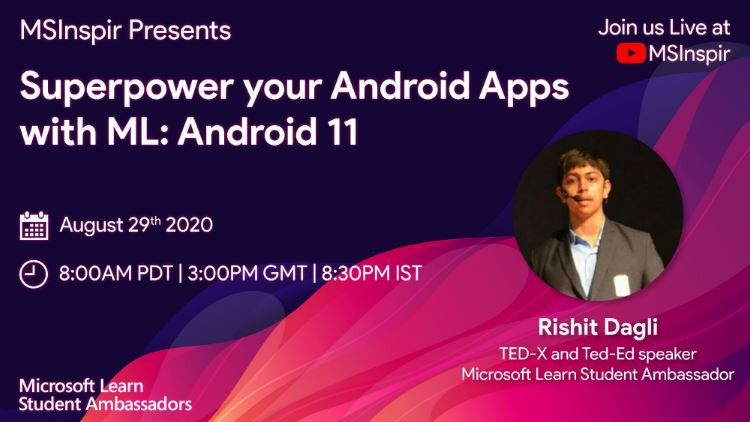

# Talks

Special thanks to-

* [@sayakpaul](https://github.com/sayakpaul) (ML GDE)
* [@khanhlvg](https://github.com/khanhlvg) (Google)
* [@hoitab](https://github.com/hoitab) (Google)

who helped me in putting together and reviewing the slides for the talks.

## Android-Stream-Day-2020

My session at [Android Stream Day](https://www.eventbrite.com/e/android-stream-day-season-1-tickets-112068517954) about Superpower your Android 
Apps with ML, 8-9 August 2020.
Special thanks to [@iampawan](https://github.com/iampawan) and 
[@RivuChk](https://github.com/RivuChk) for hosting me.

### [Registration](https://www.eventbrite.com/e/android-stream-day-season-1-tickets-112068517954)

### [Schedule and further deatils](http://stream.mtechviral.com/)

### [Tweet 1](https://twitter.com/imthepk/status/1291651271506587648?s=20)

### [Tweet 2](https://twitter.com/rishit_dagli/status/1291813949214789632?s=20)

## Microsft Student Inspir

My session at [Microsft student Inspir](https://www.meetup.com/mspinspire/events/272874554/) about Superpower your Android 
Apps with ML, 29 August 2020.
Special thanks to [@salmanmkc](https://github.com/salmanmkc), 
[@dawoodiddris](https://github.com/dawoodiddris),
[@sundereshwar](https://github.com/sundereshwar) and
[@Sabihashaik](https://github.com/Sabihashaik)

### [Registration](https://www.meetup.com/mspinspire/events/272874554/)

### [Recording](https://www.youtube.com/watch?v=fN-lCW9fHsE)
